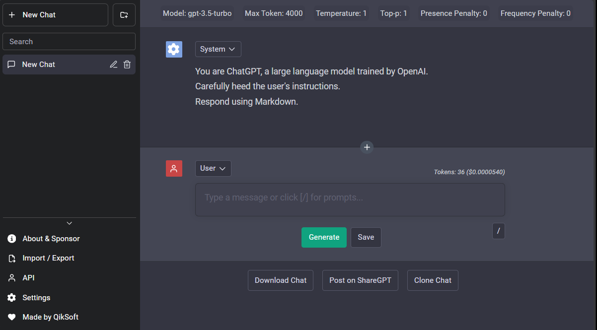

<h1 align="center"><b>Easy ChatGPT</b></h1>

<p align="center">
    <a href="https://easychatgpt.qikaivision.com/" target="_blank"></a>
</p>

<h4 align="center"><b>Free & Powerful - Bring Your Own API Key</b></h4>

<p align="center">
    <a href="https://easychatgpt.qikaivision.com/">Enter Website</a>
</p>
<p align="center"><i>Did you enjoy using Easy ChatGPT? Give it some love with a star! 🌟</i></p>

## 👋🏻 Introducing Easy ChatGPT

<p align="center">
    <a href="https://easychatgpt.qikaivision.com/" target="_blank">
        
    </a>
</p>

Are you ready to unlock the full potential of ChatGPT with Easy ChatGPT?

Easy ChatGPT is the ultimate destination for anyone who wants to experience the limitless power of conversational AI. With no limits and completely free to use for all, our app harnesses the full potential of OpenAI's ChatGPT API to offer you an unparalleled chatbot experience.

Whether you're looking to chat with a virtual assistant, improve your language skills, or simply enjoy a fun and engaging conversation, our app has got you covered. So why wait? Join us today and explore the exciting world of Easy ChatGPT!

# 🔥 Features

Easy ChatGPT comes with a bundle of amazing features! Here are some of them:

- Bring your own OpenAi API key, save money by cutting out middle man sites
- OpenAi API key securely stored in YOUR browser, never online
- Proxy to bypass ChatGPT regional restrictions
- Prompt library
- Organize chats into folders (with colours)
- Filter chats and folders
- Token count and pricing
- ShareGPT integration
- Custom model parameters (e.g. presence_penalty)
- Chat as user / assistant / system
- Edit, reorder and insert any messages, anywhere
- Chat title generator
- Save chat automatically to local storage
- Import / Export chat
- Download chat (markdown / image / json)
- Sync to Google Drive
- Azure OpenAI endpoint support
- Multiple language support (i18n)

# 🛠️ Usage

To get started, simply visit our website at <https://easychatgpt.qikaivision.com/>. There are 3 ways for you to start using Easy ChatGPT.

1. Enter into the API menu your OpenAI API Key obtained from [OpenAI API Keys](https://platform.openai.com/account/api-keys).
2. Utilize the api endpoint proxy provided by [ayaka14732/ChatGPTAPIFree](https://github.com/ayaka14732/ChatGPTAPIFree) (if you are in a region with no access to ChatGPT)
3. Host your own API endpoint by following the instructions provided here: <https://github.com/ayaka14732/ChatGPTAPIFree>. Subsequently, enter the API endpoint into the API menu.

## Desktop App

Download the desktop app [here](https://github.com/ztjhz/EasyChatGPT/releases)

| OS      | Download  |
| ------- | --------- |
| Windows | .exe      |
| MacOS   | .dmg      |
| Linux   | .AppImage |

### Features:

- Unlimited local storage
- Runs locally (access Easy ChatGPT even if the website is not accessible)

# 🛫 Host your own Instance

If you'd like to run your own instance of Easy ChatGPT, you can easily do so by following these steps:

## Vercel

One click deploy with Vercel

[](https://vercel.com/new/clone?repository-url=https%3A%2F%2Fgithub.com%2oleteacher%2FEasyChatGPT)

### Running it locally

1. Ensure that you have the following installed:

   - [node.js](https://nodejs.org/en/) (v14.18.0 or above)
   - [yarn](https://yarnpkg.com/) or [npm](https://www.npmjs.com/) (6.14.15 or above)

2. Clone this [repository](https://github.com/ztjhz/EasyChatGPT) by running `git clone https://github.com/ztjhz/EasyChatGPT.git`
3. Navigate into the directory by running `cd EasyChatGPT`
4. Run `yarn` or `npm install`, depending on whether you have yarn or npm installed.
5. Launch the app by running `yarn dev` or `npm run dev`

### Running it locally using docker compose
1. Ensure that you have the following installed:

   - [docker](https://www.docker.com/) (v24.0.7 or above)
      ```bash
      curl https://get.docker.com | sh \
      && sudo usermod -aG docker $USER
      ```

2. Build the docker image
   ```
   docker compose build
   ```

3. Build and start the container using docker compose
   ```
   docker compose build
   docker compose up -d
   ```

4. Stop the container
   ```
   docker compose down
   ```

# 🙏 Support

At Easy ChatGPT, we strive to provide you with useful and amazing features around the clock. And just like any project, your support and motivation will be instrumental in helping us keep moving forward!

If you have enjoyed using our app, we kindly ask you to give this project a ⭐️. Your endorsement means a lot to us and encourages us to work harder towards delivering the best possible experience.

If you would like to support the team, consider sponsoring us through one of the methods below. Every contribution, no matter how small, helps us to maintain and improve our service.

KoFi => [](https://ko-fi.com/dplr)

Thank you for being a part of our community, and we look forward to serving you better in the future.
